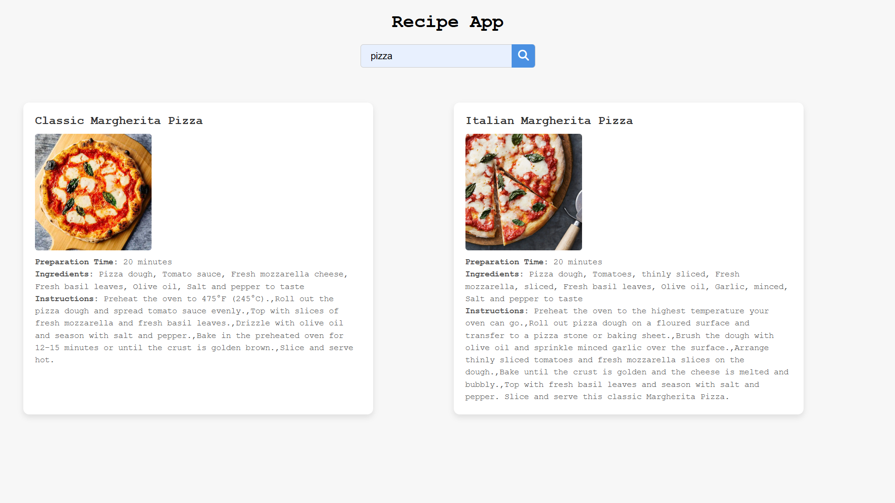

# 🍳 Recipe App

A simple and responsive recipe search app built with **HTML**, **CSS**, and **JavaScript**.  
This app allows users to search for recipes using the [DummyJSON Recipes API](https://dummyjson.com/docs/recipes) and view ingredients, instructions, and preparation time in a clean UI.

---

## 🚀 Features

- 🔍 Search for recipes by name
- 📋 View ingredients, preparation time, and instructions
- 📸 Display recipe image
- 🧠 Auto-fetches all recipes on page load
- 🧼 Clears and resets the recipe list when input is cleared
- 💡 Responsive design for mobile and desktop

---

## 🖼️ Screenshot


(assets/recipe-app-preview2.png)

---

## 📦 Installation

1. **Clone the repository:**

```bash
git clone https://github.com/IulianFrunza98/recipe-finder.git
cd recipe-finder
```

🌐 API Used
DummyJSON Recipes API

📌 Future Improvements
Add recipe categories or filters

Pagination for long result lists

Save favorite recipes (with localStorage)

Dark mode 🌙

🧑‍💻 Author
Made with ❤️ by [Iulian]
GitHub • LinkedIn
